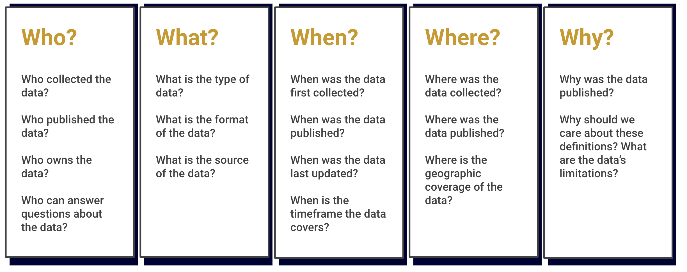
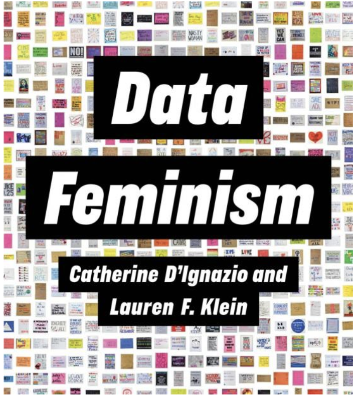
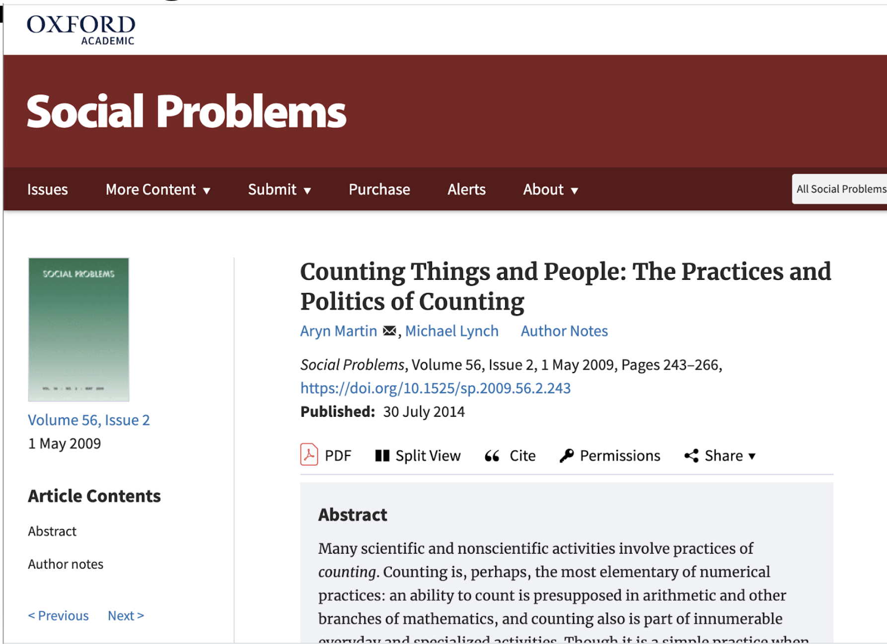
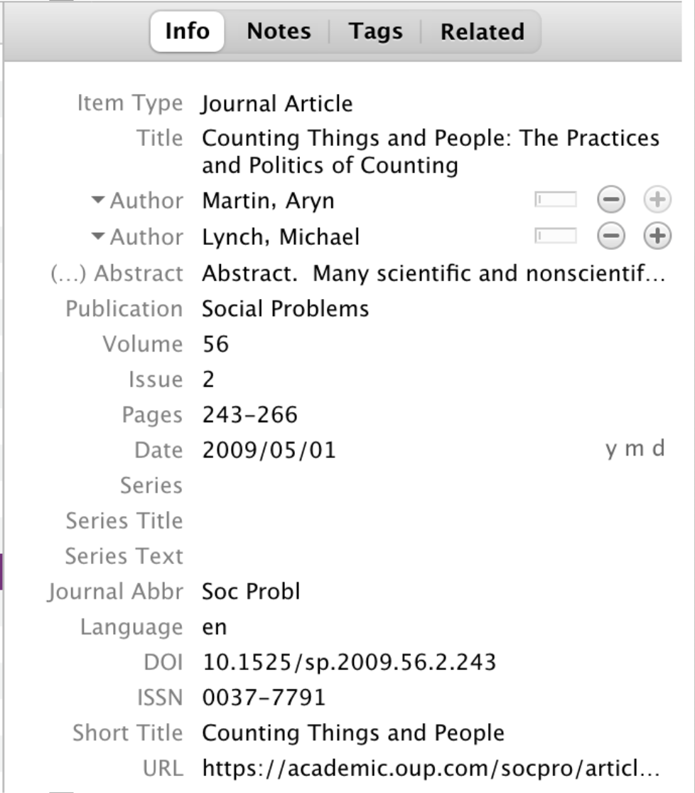
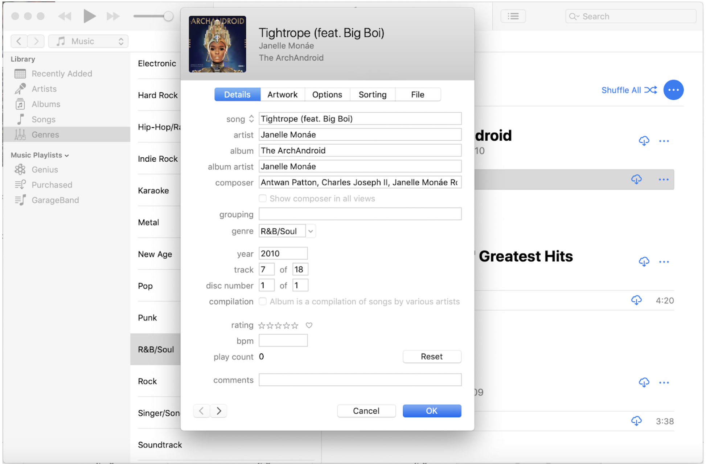

```{r setup, include=FALSE}
options(htmltools.dir.version = FALSE)
```

```{r xaringan-themer, include=FALSE}
# sds::duo_smith()
sds::mono_light_smith()
```

class: center, middle
# What were some takeaways from Monday's class?

---

class: center, middle
# How do we define metadata?

---

# 5 W's of Metadata



---

class: center, middle
# Why is metadata important?

---

# Example: Library Catalog

.pull-left[

]

.pull-right[

]

---

# Metadata Schemas

* A standardized labeling system for cataloging or describing data
* Enables search engines to index data by certain criteria
* Examples:
  * Sort by "date created"
  * Retrieve all results from a specific "author/creator"
  * Filter results to a specific "subject"
  * Exclude results from a specific "publisher"


---

# Example: Citation Manager

.pull-left[

]

.pull-right[

]

---

# Example: Citation Manager



---

class: center, middle
# What’s the difference between administrative and descriptive metadata?

---


  
---

# Data Dictionaries

* Documents for holding descriptive metadata
* Define the variables in a dataset and the values that may fill in those variables
* Are not always as descriptive as we'd like them to be

---

class: center, middle
# Example: NYC Metadata for All


---

# For Monday

* Questions to consider:
  * What does Biruk mean when they refer to "translation" in this chapter?
  * Where do we see looping effects in this chapter? What gets "lost in translation"?

