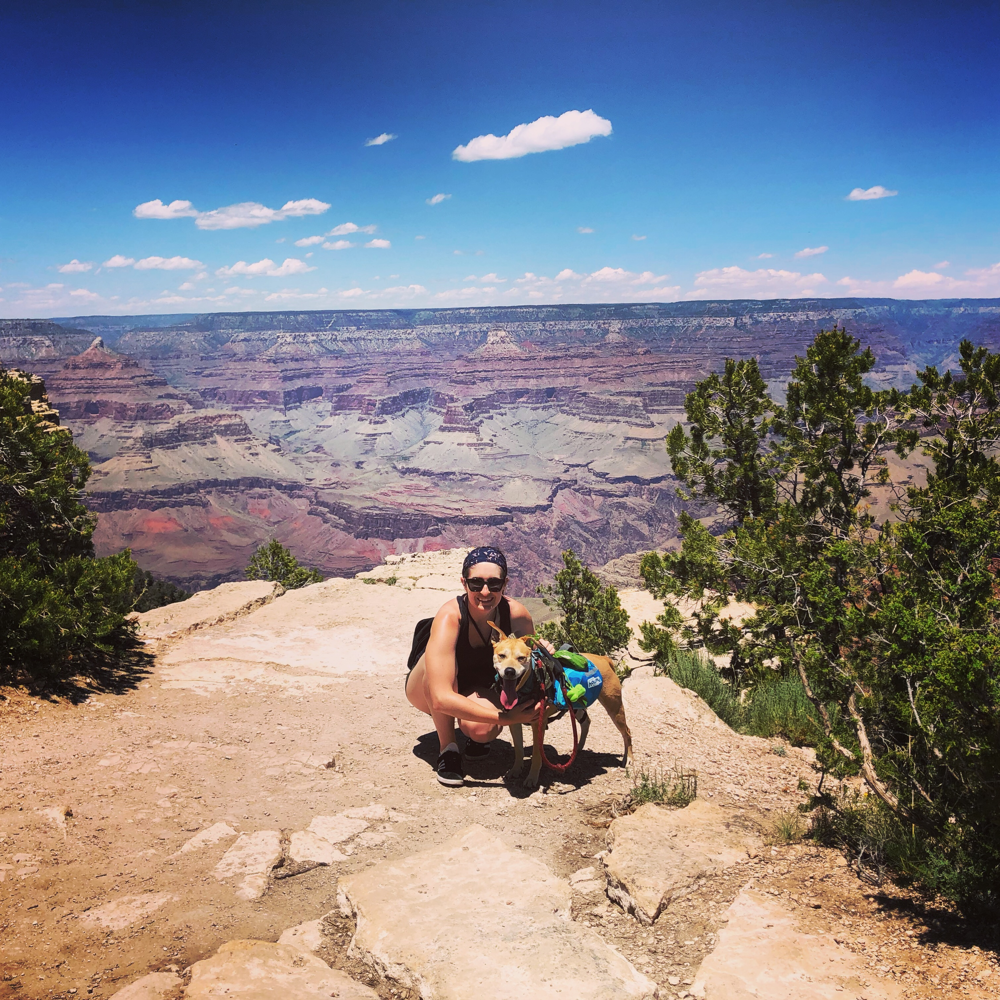

```{r setup, include=FALSE}
options(htmltools.dir.version = FALSE)
```

```{r xaringan-themer, include=FALSE}
# sds::duo_smith()
sds::mono_light_smith()
```

# What is ethnography?

.pull-left[

* study of human culture and social relations
* involves interactions and observations, recording, and analysis
* data collection methods are predominantly qualitiatve 
* analysis is predominantly *inductive* and *interpretive*
]

.pull-right[


Brian Brondel at English Wikibooks, CC BY-SA 2.5 <https://creativecommons.org/licenses/by-sa/2.5>, via Wikimedia Commons

]

---

class: center, middle
# What is data?

---

# What fields of research inform data ethnography?

* Science and Technology Studies (STS)
  * an interdisciplinary field that examines how science, technology, politics, and culture all co-produce each other
  * STS disciplines include anthropology, sociology, literary studies, political science, economics, and more
  * What might be some examples?
* Critical Data Studies
  * an interdisciplinary field examining the epistemological, political, social, and ethical aspects of data artifacts, practices, and infrastructures
  * What are some political dimensions of data? Examples?
  * What are some ethical dimensions of data? Examples?
  * Is there a difference?
  
---

# Who is the professor? Why is an anthropologist teaching data science?

.pull-left[
* Please call me Lindsay (preferred), Professor Poirier, or Dr. Poirier
* Previously Assistant Professor of Science and Technology Studies at UC Davis
* Lab Manager at [BetaNYC](https://beta.nyc/)
* M.S./Ph.D. in Science and Technology Studies from Rensselaer Polytechnic Institute
* B.S. in Information Technology and Web Science from Rensselaer Polytechnic Institute
* Dancing, crafting, cooking, re-watching the same TV series over and over again.
* I have a *very* spunky dog Madison who you may hear on Zoom calls. 
]

.pull-right[

]
  
---


# Exercise

.pull-left[

<iframe width="512" height="332" src="https://player.pbs.org/viralplayer/2365415341/" allowfullscreen allow="encrypted-media" style="border: 0;"></iframe>

]

.pull-right[

* Ethnographers often collect more data than they know what to do with
* Write as much as possible about:
  * what people do/why they do it
  * beliefs/values/expertise
  * social structures
  * questions you are left with
  
]

---


# Syllabus Review

* Policies
* Grading Contract
* Course Website
* Moodle
* Perusall
* Slack

---


# For Wednesday

* Reading and annotations in Perusall
* Review Syllabus
* Install Slack Desktop and set notifications
* Fill out first day of class questionnaire

